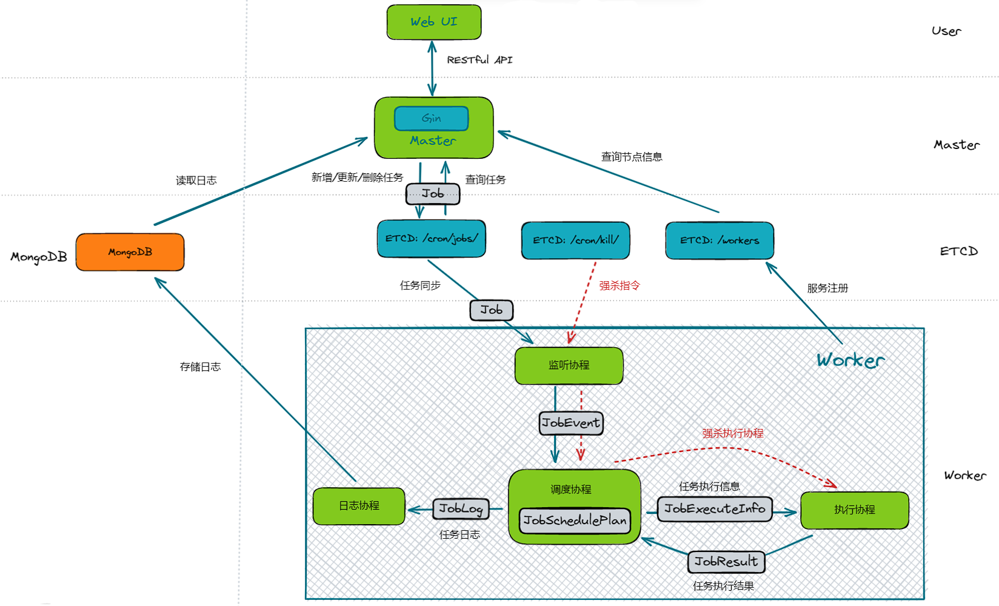

## etcd-crontab

### 概述

`etcd-crontab` 是一个基于 ETCD 数据库实现的分布式任务调度应用

应用是为了解决 Linux 单机 crontab 的痛点：

- 机器故障，任务停止调度，甚至会丢失 crontab 配置
- 任务数量多，单机的硬件资源耗尽，需要人工迁移到其他机器
- 需要人工 SSH 连接到机器上配置 cron，任务执行状态不方便查看

### 特点

- 基于 Vue3 技术栈实现 Web UI 前端界面，方便用户对任务进行增删改查、终止和日志查看
- 基于 Gin Web 框架实现 HTTP API，提供给前端应用使用，实现前后端分离
- 基于 ETCD 实现数据强一致性的任务调度功能，提供随机、轮询、指定节点三种模式的任务分发和任务终止
- 基于 MongoDB 异步批量存储任务执行日志，提供可视化日志查看功能
- 基于 MongoDB 异步存储任务执行日志，提供可视化日志查看功能
- 使用 Dockerfile 编写镜像文件，基于 Docker Compose 快速部署应用

### 技术栈

- 前端技术栈：TypeScript，Vue3，Axios，Tailwind CSS，Vite
- 后端技术栈：Go，Gin，ETCD，MongoDB
- 部署环境：Linux，Docker，Docker Compose，Caddy（用于反向代理和静态文件服务）

### 实现思路

#### 整体设计

- 用户通过 Web UI 界面，对任务进行增删改查，提交任务信息到 Master 节点
- Master 节点获取到任务信息，解析后选择合适的工作节点，向 ETCD 中写入任务数据
- Worker 节点通过监听机制，监听变化的任务，根据任务信息判断是否需要自己执行
- Worker 节点根据任务信息，生成执行计划，周期性调度执行
- Worker 执行完毕后，将任务执行日志写入到 MongoDB 中
- Master 节点可以从 MongoDB 中拉取日志数据，并通过 Web UI 展示给用户

#### 核心要点

- Master 和 Worker 之间不直接接触，而是通过强一致性中间件 ETCD 进行交流

- 满足 CAP 理论中的 CP 模型，保证数据一致性
