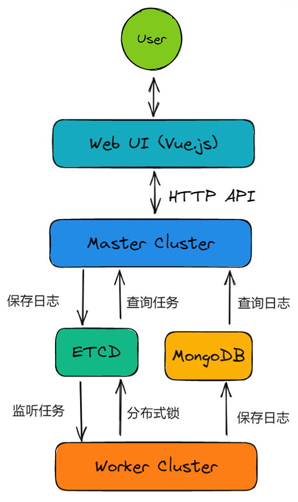
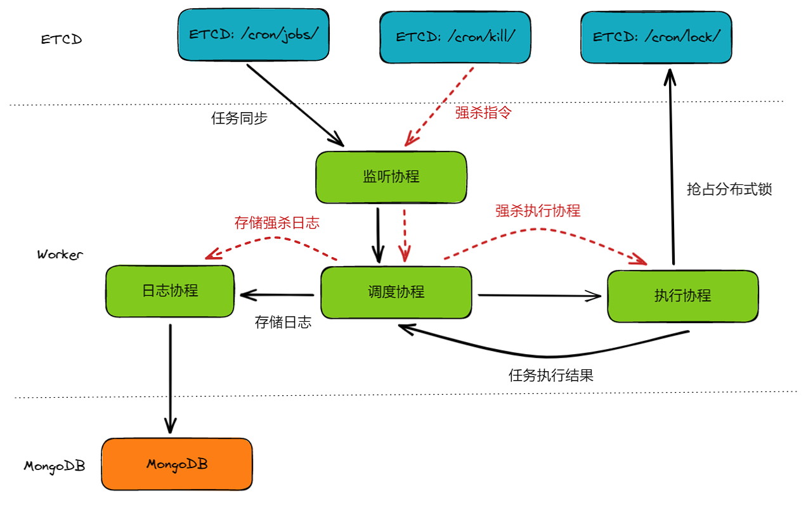

## etcd-crontab

### 概述

`etcd-crontab` 是一个基于 ETCD 数据库实现的分布式任务调度应用

应用是为了解决 Linux 单机 crontab 的痛点：

* 机器故障，任务停止调度，甚至会丢失 crontab 配置
* 任务数量多，单机的硬件资源耗尽，需要人工迁移到其他机器
* 需要人工 SSH 连接到机器上配置 cron，任务执行状态不方便查看

### 特点

* 基于 Vue 3 技术栈提供一个 Web UI 界面，方便用户对任务进行增删改查和强杀
* 基于 Gin 实现提供给前端界面使用的 HTTP API
* 基于 ETCD 实现数据强一致性的任务调度平台，支持任务分发和任务强杀
* 基于 MongoDB 异步批量存储任务执行日志，提供可视化日志查看功能
* 提供精确到秒的 Cron 表达式能力（Linux 自带的 crontab 不支持秒级别）

### 技术栈

* 前端技术栈：Vue 3，Axios，TypeScript，Vite
* 后端技术栈：Go，Gin，ETCD，MongoDB
* 部署环境：Linux，Docker，Docker Compose，Caddy（用于反向代理）

### 实现思路

#### 整体设计

* 用户通过 Web UI 界面，对任务进行增删改查，提交到 Master 节点
* Master 节点向 ETCD 中写入任务变化数据
* 通过监听机制，Worker 节点拉取 ETCD 中全量任务列表到本地
* 每个 Worker 独立调度全量任务，利用分布式锁抢占任务，避免并发调度相同任务的问题
* Worker 执行完毕后，将任务执行日志写入到 MongoDB 中
* Master 节点可以从 MongoDB 中拉取日志数据，并通过 Web UI 展示给用户

#### Worker核心设计

#### 核心要点

* Master 和 Worker 之间不直接接触，而是通过强一致性中间件 ETCD 进行交流

* 满足 CAP 理论中的 CP 模型，保证数据一致性

